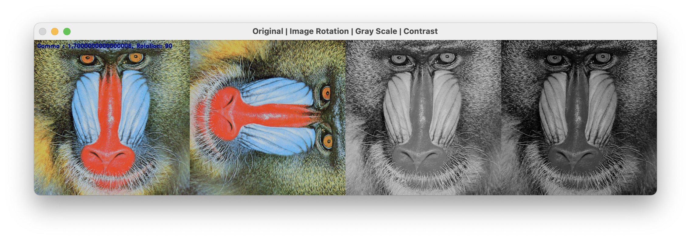

# my_tiny_photo_editor

simple openCV-python photo editor

## Feature

- show original image
- rotate 90, 180, 270
- show original image to gray scale
- edit contrast
- download

## How to use

|     key     |     action     |
| :---------: | :------------: |
|     'r'     |  rotate image  |
| '+' or '-'  | gamma up/down  |
| 'd' + 1 ~ 4 | download image |

## screenshot

